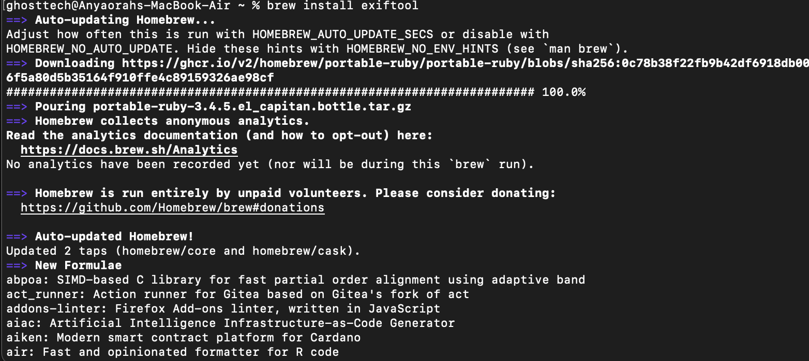
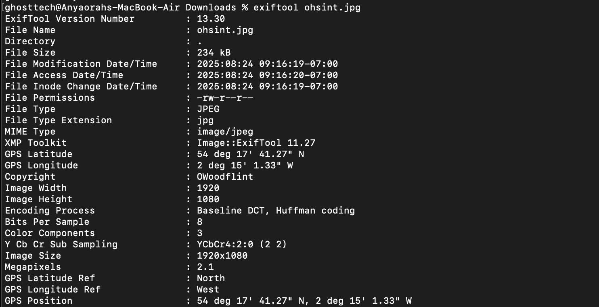
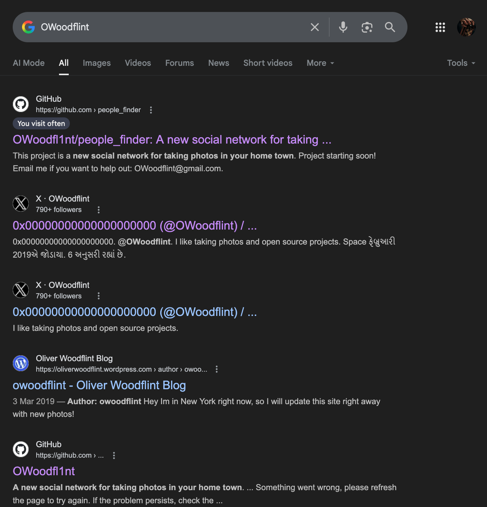
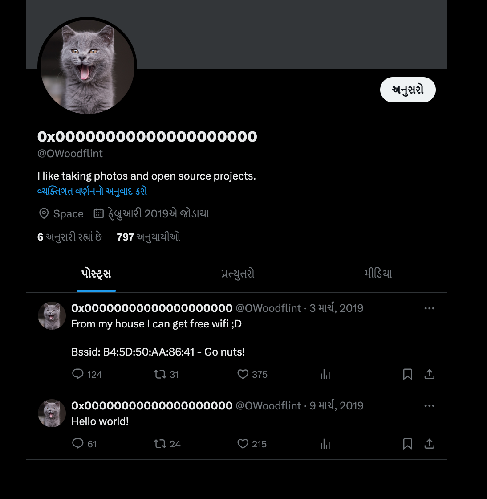
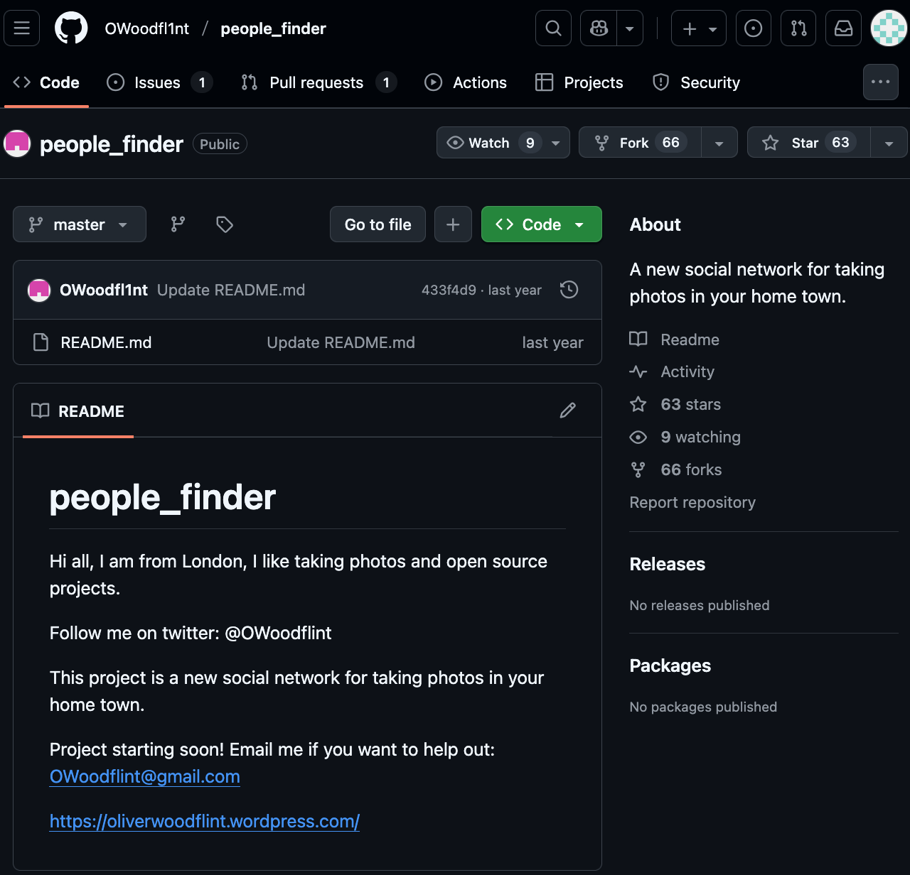
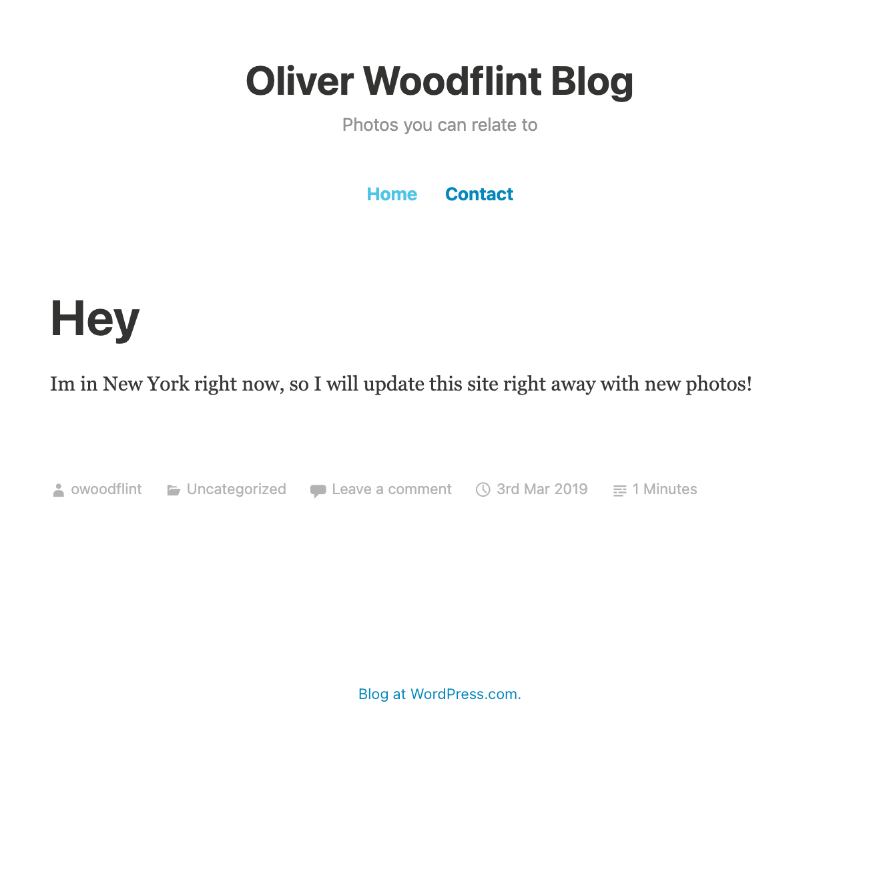
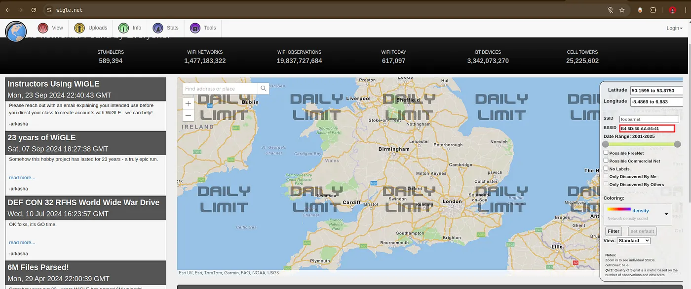

OhSINT-Tryhackme Walkthrough

# Ohsent-Tryhack-me
this is a solution of ohsent test in tryhack me.
In this challange our main objective is to gather information Passively. For Example: From Carefule Image Observation, Metadata Extraction, Google Dorking and Other passive reconisance tools.
OSINT can be used for a variety of purposes, including:

# Cybersecurity
Assessing security risks, identifying vulnerabilities in IT systems, and exposing targets for cyberattacks

# Social engineering
Creating tailored phishing emails

# Legal
Gathering evidence, conducting due diligence, and supporting case preparation

# Market research and brand monitoring
Gathering information on consumer behaviors, industry trends, and competitor activities

In this challange, we are given an Image and our Job is to Perform Open-Source Intelligence and answer some questions given to us.

# exfil installation
if you are using macOS you might notice that exiftool is not installed so you have to install it so that you will be able to use it to open the image details and know the author of the image and all the image information.

# Solution: 
Its an Image file, we dont have any other information the first thing to do is to extract metadata of Image file with Exiftool. Here I’ll be using online Exiftool.

As a result of doing this, we’ve uncovered some interesting details. We found out things like who owns the rights to the image and even where it was taken, as you can see in the picture above.

After doing a quick search on Google using the word ‘OWoodflint’, we found three web pages. One is on Twitter, another on GitHub, and a third one on WordPress. You can see them in the picture below. To answer the first question about the user’s picture, there’s a hint that suggests they might have a social media account. So, it’s a good idea to check out their Twitter profile.

# What is this user’s avatar of?
the answer is cart

# What city is this person in?
After open the Github like We That the person is from London. See the below screenshort.

# What is his personal email address?
the awnser is OWoodflint@gmail.com

# What site did you find his email address on?
answer is Github

# What’s the SSID of the WAP he connected to?
 Using the hint given in the question you get to know that to know the city where the person is you need to use BSSID and Wigle.net
 If you open the Twitter link from the previous search you will see the BSSID value “Bssid: B4:5D:50:AA:86:41” in the tweets as shown in the below screenshot.
 Here, I have reached my daily limit but you can search by entering BSSID into the input box. But for anser of the SSID of WAP he connected is “UnileverWifi”.

 ansswer is UnileverWifi

 

# Where has he gone on holiday?

the answer is NewYork city

 

 # What is the person’s password?

 the answer is pennYDr0pper.! it is gotten for the worldpress site. Since the password was written in white font color, it was not visible on the page. However, by using the “ctrl+a” to select all and highlighting the entire text on the page, the password would become visible.

 

 In Summary, this challange was very interesting for people who want to experience the tools and methodlogy of Open Source intelligence. The Tools we used here are Exiftool web-based, Google Docs and Web page source page inspection.